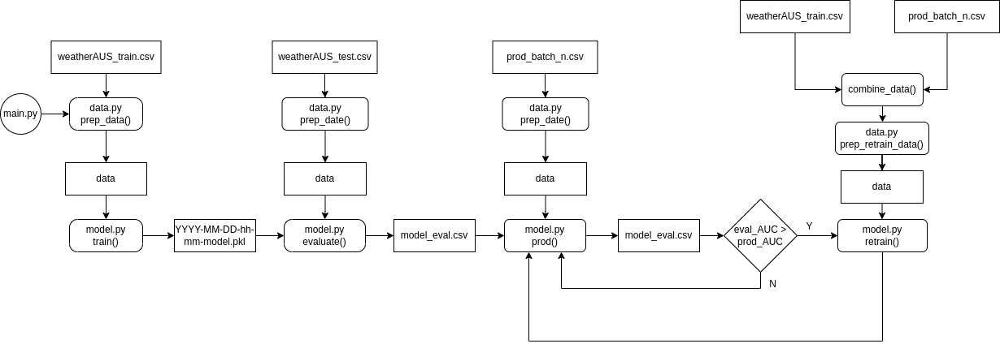

# ASI Project - Prediction of rain in Australia

## Table of Contents
- [General info](#General-info)
- [Data](#Data)
- [Architecture](#Architecture)
- [Setup](#Setup)
- [Author](#Author)

## General info

This program can be used to predict if it will rain the next day in Australia.

## Data

This dataset contains about 10 years of daily weather observations from many locations across Australia.

RainTomorrow is the target variable to predict. It means -- did it rain the next day, Yes or No? This column is Yes if the rain for that day was 1mm or more.

For this experiment the data was divided into few csv files.

File with label train is used in initial training and in is part of data used to retrain model.

File with label test is used to evaluate trained model.

Files with label prod try to imitate production environment where new data is sent to the system periodically.

## Architecture



## Setup

1. Unzip data package in data folder
```
unzip data.zip
```
2. Create conda environment from yaml file
```
conda env create -f asi_env.yml --name asi
```
3. Activate conda environment
```
conda activate asi
```
4. Run the program
```
python main.py
```

## Author

Adam Piotrowski
